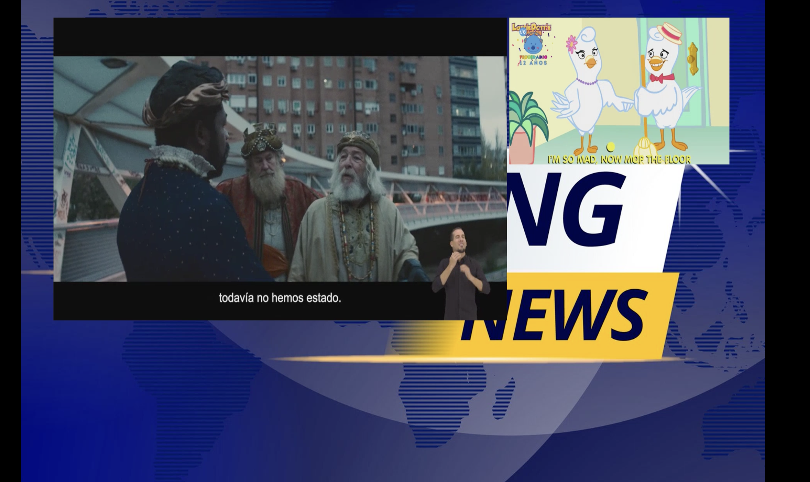
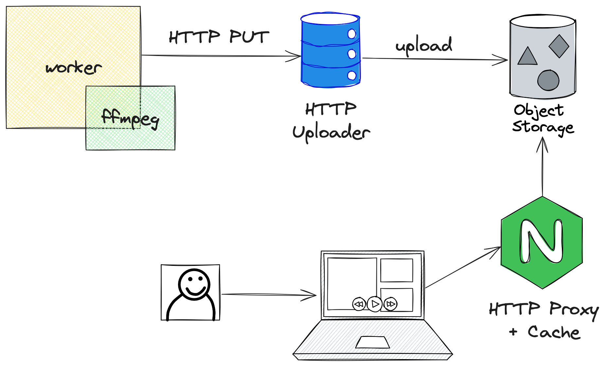

# Mosaic Video

Generate mosaic videos from live inputs.

## What is it?

*Mosaic Video* is a project designed to transform live streaming videos into nice mosaics in realtime.

It uses ffmpeg to capture the video and position them in a grid.

## Design

The project has two main components:
* Worker: a Go process that receives the inputs and generates the mosaic;
* Storage backend:
    * HTTP server that receives the mosaic through HTTP and stores it on S3;
    * Or a local storage backend (local filesystem).

## Features

* Generate mosaic from multiple video inputs;
* Multiples audios support:
    * No audio;
    * First input audio only;
    * All inputs audios.
* Available inputs: HLS, RTMP and MP4;
* Available outputs: HLS;
* A simple HLS Player available in: http://localhost:8090/player;
* Dynamic scaling/positioning of the inputs;
* Dynamic background for each mosaic;
* Storage and delivery content options:
    * S3;
    * File system.
* VoD in looping.
    * To use like a promo video, see this [example](https://streamable.com/093xvt).

## Roadmap

* Support for running distributed workers.

## Running

To run the project, certain environment variables need to be set. These variables can be found in the [.env](.env) file.

Each worker, when running, fetches mosaic settings from an API. A mock API is available, detailed in [tasks.json](testing/tasks.json). Below is a breakdown of each field in the JSON:

* **name**: A string identifier for the mosaic configuration. In this case, it's set to "mosaic".
* **background_url**: The URL of the background image to be used in the mosaic. It is a link to an image file.
**medias**: An array of objects, each representing a media element in the mosaic. Each object in this array has the following fields:
    * **url**: The URL of the media source. This can be a live stream or a video file. Examples include HLS (.m3u8) links and local video files (e.g., "subscribe.mp4").
    * **position**: An object specifying the x and y coordinates (in pixels) of the top-left corner of this media element within the mosaic.
    * **scale**: The size of the media element in the format "width x height" (in pixels).
    * **is_loop** (optional): A boolean indicating whether the video should loop. This is relevant for video files rather than live streams.
* **audio**: This field specifies how the audio should be handled in the mosaic. The options include "no_audio", "first_input", or "all_inputs". In this JSON, it's set to "first_input", meaning only the audio from the first media input will be used.

## Commands

`just test` to run the tests.

`just lint` to run linters.

`just deps` starts a mock API, Redis and S3 backend.

`just worker` starts the go process to generate mosaics.

`just storage` startes the uploader component.

`just player` starts the HLS player.

## Installation

We are still working on the installation process. For now, you can install it by cloning the repository and running separately the components (see "Running and tests" section).

## Contributing

Feel free to contribute to this project by opening issues or pull requests.
